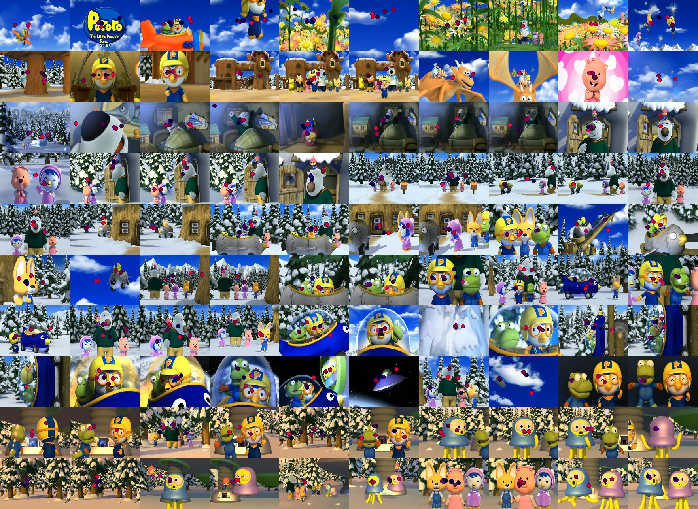

Visual Attention Model for KidsVideo
====================================

## Usage

### Step 1. fixation.py

Get the Tobbi Glasses' fixation data aligned to the subtitles' timestamps.

#### Input

- *data/pororo_s03p01_jhkim.tsv* - Tobbi Glasses' exported data. **(I1)**
- *data/pororo_1.smi* - SMI subtitles file for Pororo Season 3. **(I2)**

#### Output

- *timings.txt* - Subtitles' start time in millisecond. **(O1)**
- *fixation.out* - Tobbi Glasses' data aligned to the subtitiles' timestamps. **(O2)**

| Time	| Record	| Normalized_X	| Normalized_Y	| X	| Y |
|-------|-----------|---------------|---------------|---|---|
| Subtitiles's Timestamp | Fixation's Timestamp | Normalized X | Normalized Y | Raw X | Raw Y |

### Step 2. showFixation.m

#### Input

- **O1** and **O2** from *fixation.py*.
- *screenshots/pororo_1_XXXXX.bmp* - Screenshot images by *capture.py*.

It shows the fixation data on the screenshot images. The below image is 100 screenshots and its fixations. Pure red dot means the first fixation in 2 sec time span (from 1 sec before to 1 sec after) and, more darker as time goes.

## Protocol

1. Prepare Tobbi Glasses to have **enough battery life**. 
(Approximately 70 min when fully charged.)

2. Check the IR markers' **battery status**. You can also check the markers in Tobbi Snapshot preview at _Step 3_.
(Green 90%, Yellow 50%, Red 10%)

3. Let the subject sit in front of screen after finishing the calibration with more than 3 stars. Using the mobile device, **take a snapshot** to make sure the all markers' health is okay and in later, to use as a coordinate indicator for eye movements in the screen.

4. When finishing the recording, save the tsv data (format is below.) with the Glasses' recorded video and snapshot at _Step 3_.

	- MediaWidth
	- MediaHeight
	- RecordingTimestamp
	- FixationIndex
	- SaccadeIndex
	- GazeEventType
	- GazeEventDuration
	- FixationPointX (MCSpx)
	- FixationPointY (MCSpx)
	- GazePointX (ADCSpx)
	- GazePointY (ADCSpx)

## Experiment Outputs

- *pororo_s03p01_jhkim.tsv* - In _Step 4_.
- *pororo_s03p01_jhkim_all.tsv* - Export all fields.
- *pororo_s03p01_jhkim.jpg* - Tobbi Snapshot used in the recording.
- *pororo_s03p01_jhkim.avi* - Visualization video at least 10 sec from the beginning to sync with the media.
